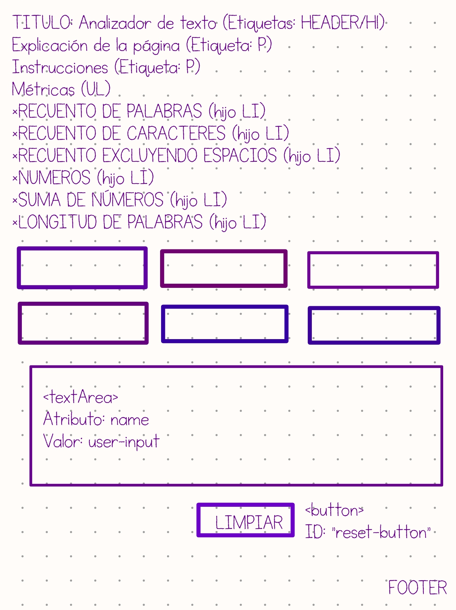
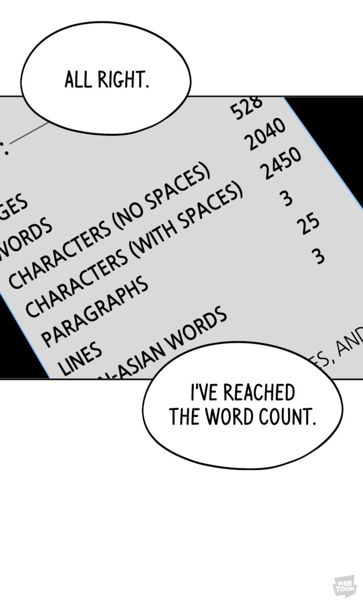

Analizador de texto

## Índice
* [1. Consideraciones generales](#1-consideraciones-generales)
* [2. Funcionalidades](#2-funcionalidaes)
* [3. Boiler-Plate](#3-boilerPlat)
* [4. Desarrollo](#4-desarrollo)
* [5. Curiosidad](#5-curiosidad)

## 1. Consideraciones generales

* Este proyecto fue realizado por Saharai Rodríguez Hernández.
* Me tomé 3 sprints para completarlo.

## 2. Funcionalidades
Es un analizador gratuito para brindar información básica de la estructura de un texto, bajo las siguientes métricas
*Recuento de palabras
*Recuento de caracteres
*Recuento de caracteres excluyendo espacios y signos
*Recuento de números
*Suma total de los numeros
*Longitud media de las palabras.

*La página web está conformada por un área de texto, los cálculos se muestran en tiempo real y en los espacios indicados a medida que se escribe el texto.
*Tiene un botón LIMPIAR para reiniciar los cálculos de las métricas y limpiar el área.

## 3. Boilerplate

Está realizado en JavaScript puro (Vanilla JavaScript), HTML y CSS, con el siguiente boilerplate:

### Descripción de scripts / archivos

* `README.md`: debes modificarlo para explicar la información necesaria para el
  uso de tu aplicación
  web, así como una introducción a la aplicación, su funcionalidad y decisiones
  de diseño que tomaron.
* `.github/workflows`: esta carpeta contine la configuracion para la ejecution
  de Github Actions.
* `docs/images`: contiene las imagenes de este README.
* `read-only/`: esta carpeta contiene las pruebas de criterios mínimos de
  aceptación y end-to-end.
 
* [`src/index.html`](./src/index.html): este es el punto de entrada de la aplicación
* [`src/style.css`](./src/style.css): este archivo contiiene las reglas de estilo.
* [`src/analyzer.js`](./src/analyzer.js): implementación del objeto
  `analyzer`. Este objeto (`analyzer`) contiene los siguientes métodos:
  - `analyzer.getWordCount(text)`: retorna el recuento de palabras que se encuentran en el parámetro `text`.
  - `analyzer.getCharacterCount(text)`: retorna el recuento de caracteres que se encuentran en el parámetro `text`.
  - `analyzer.getCharacterCountExcludingSpaces(text)`: esta función retorna el número de caracteres excluyendo espacios que
se encuentran en el parámetro `text`.
  - `analyzer.getNumberCount(text)`: retorna cuántos números se detectan en el parámetro `text`.
  - `analyzer.getNumberSum(text)`: función que retorna la suma de los números encontrados en el parámetro `text`.
  - `analyzer.getAverageWordLength(text)`: retorna la longitud media de palabras que se encuentran en el parámetro `text`.
  En este caso usa 2 dígitos decimales.
  - `inicializarContadores`: función que se invoca al presionar el botón de LIMPIAR y reinicia a 0 los contadores de las métricas.
* [`src/index.js`](./src/index.js): escucha los eventos del DOM,invoca las funciones.
* [`test/analyzer.spec.js`](./test/analyzer.spec.js): este archivo contiene las
pruebas unitarias para los métodos del objeto `analyzer`.

## 4. Desarrollo
* Empecé con la configuración de GitHub y VSCode.
* Leí acerca de los usos de analizadores de texto y los ámbitos dónde se utilizan para poder decidir el diseño de la aplicación.
* Realicé un boceto del HTML, para saber la distribución de los elementos.

  
* Implementé el diseño de HTML junto con la información e hice los estilos de CSS.
* Me documenté sobre información técnica de CSS (box model, REM/EM, atributos...)
* Me metí de lleno a Javascript, dando funcionamiento al botón y capturar el texto del textarea
* Realicé los algoritmos para cada una de las funciones, probé con diferentes formas de identificar los números, pase por usar código ASCII luego isNaN, pero tenía que pasar caracter por caracter, lo había dejado porque funcionaba, pero al llegar a identificar los decimales o los "no números" se complicaba, así que cambié a expresiones irregulares.
* En mi primer sprint me sugirieron algunos cambios en el diseño, como el color de las letras y contrastes, eso lo dejo hasta el final, porque me distraigo mucho con CSS.
* Mis primeros errores en los test fueron fáciles de solucionar, pero tuve uno que tardé mucho en entender y que se resolvió en un OH y era simplemente un retorno de 0 en los "no números", lo cual se estaba haciendo con la variable, pero no estaba siendo detectada de esa manera.
* Terminando de pasar todos los tests, realicé los cambios en el CSS y se completo este README

## 5. Curiosidad
Me gusta leer "cómics" de una aplicación que se llama WebToon de diseñadores, escritores independientes que suben sus historietas y uno de los que estoy leyendo, la cuál la protagonista es escritora, precisamente usa un analizador, se me hizo curioso estar trabajando en esto y me saliera un uso :)

